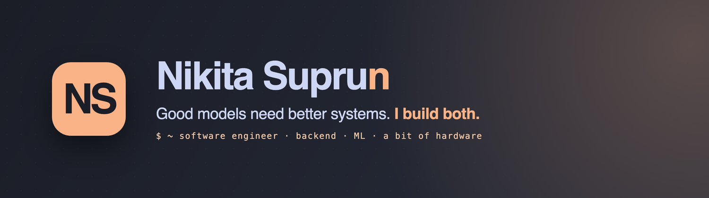

<!-- Profile README for github.com/NikitaSuprun. Brand: peach #FAB387 on dark #232733. -->

  

### `whoami`

I'm a software engineer who works across **backend systems, infrastructure and applied ML**, with a genuine interest in **finance** and a soft spot for **hardware and robotics** projects.

I earned a BSc in Engineering Physics and an MSc in Machine Learning at **KTH** in Stockholm, after the International Baccalaureate Diploma Programme in Lund and a childhood in Ukraine, treating every summer as part of the education.

Currently a software engineer at **SICS.AI**; from **August 2026** I'll be part of **Google Search** in Switzerland. Earlier: internships at **Goldman Sachs**, **Google** (Ads · Cloud), and quant research at **Nasdaq**.

### `connect`

 

<picture>
  <source media="(prefers-color-scheme: dark)" srcset="https://raw.githubusercontent.com/NikitaSuprun/NikitaSuprun/output/github-snake-dark.svg" />
  
</picture>

<!-- v1 -->
